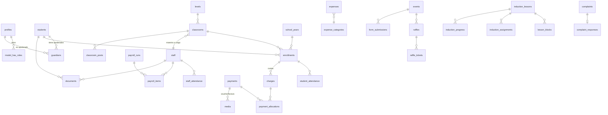

# Arquitectura de software — EP Villa Jardín (Ica)

Colegio de educación inicial + guardería. Este documento define **qué** vamos a construir, **con qué** y **en qué orden**.

---

## 1. Visión general

El sistema tiene dos caras que comparten una sola base de datos:

| Cara | Público | Objetivo |
|------|---------|----------|
| **Sitio público** (marketing) | Padres interesados, comunidad | Presentación llamativa: quiénes somos, servicios, diferenciadores, galería, videos de inducción, admisión, contacto por WhatsApp, Libro de Reclamaciones. |
| **Plataforma interna** (intranet) | Administradora, maestras, practicantes, padres, alumnos | Asistencia, pagos/morosidad, comprobantes, planilla, balance, sorteos, documentos, avisos. |

```
            ┌──────────────────────────────────────────────────────┐
            │        Navegador / Celular (PWA instalable)          │
            └──────────────────────────┬───────────────────────────┘
                                       │ HTTPS
┌──────────────────────────────────────▼───────────────────────────────────────┐
│                   SERVIDOR COMPARTIDO (cPanel / PHP 8.2+)                    │
│                                                                              │
│  public_html/ ──► Laravel /public  (index.php + assets compilados por Vite)  │
│                                                                              │
│  Laravel 11/12                                                               │
│  ├─ Rutas web públicas  → Blade/Inertia (sitio de presentación, SEO)         │
│  ├─ Rutas /reclamos     → Libro de Reclamaciones                             │
│  ├─ Rutas /app/*        → Inertia.js + React + TypeScript (intranet)         │
│  ├─ Policies / Gates + spatie/laravel-permission  (roles)                    │
│  ├─ Jobs (cola "database") + Scheduler  ◄── Cron de cPanel cada minuto       │
│  └─ Firma subidas y entrega URLs firmadas de Cloudinary (no guarda archivos) │
│                                                                              │
│  MySQL 8 / MariaDB 10.6+                                                     │
└──────────────────────────────────────┬───────────────────────────────────────┘
                                       │
        ┌──────────────────┬───────────┴──────────┐
        ▼                  ▼                      ▼
 WhatsApp Cloud API  SMTP del hosting      Cloudinary (imágenes, videos, PDFs + CDN)
 (o enlace wa.me)    (correos, reclamos)   ▲ el navegador sube directo, con firma de Laravel
```

### Stack definido

| Capa | Elección | Por qué |
|------|----------|---------|
| Backend | **Laravel 12** (PHP 8.2+) | Corre en cualquier hosting compartido con PHP; trae auth, colas, scheduler, mail, storage y migraciones. |
| Frontend intranet | **React 18 + TypeScript** vía **Inertia.js** | SPA sin construir una API aparte: los controladores de Laravel devuelven páginas React con sus props tipadas. |
| Sitio público | **Inertia + React con SSR desactivado** y páginas ligeras (o Blade para máxima velocidad/SEO) | El hosting compartido no ejecuta Node; las páginas públicas se renderizan rápido y con meta-tags correctos desde Laravel. |
| Estilos | **Tailwind CSS + shadcn/ui** (componentes React), animaciones con Framer Motion | Sitio colorido/infantil y panel ordenado con los mismos componentes. |
| Build | **Vite** (laravel-vite-plugin) | Se compila **en tu PC o en GitHub Actions**; al servidor solo se sube `public/build`. |
| Base de datos | **MySQL** (la que trae el hosting) | Columnas `json` para formularios y temas de eventos; claves foráneas InnoDB. |
| Auth | **Laravel Breeze (React + TS)** + **spatie/laravel-permission** | Login, recuperación de contraseña, roles y permisos listos. |
| Tipos compartidos | **spatie/laravel-data + typescript-transformer** (opcional) | Genera los tipos TS a partir de los DTOs PHP → frontend y backend no se desincronizan. |
| Rutas en TS | **Ziggy** | Usar `route('pagos.index')` en React. |
| Formularios/validación | Form Requests (backend) + `useForm` de Inertia + zod (frontend) | Validación siempre en el servidor. |
| Imágenes, videos y archivos | **Cloudinary** (`cloudinary-labs/cloudinary-laravel` + Upload Widget y `@cloudinary/react` en el frontend) | Subida directa desde el celular sin pasar por el hosting, optimización automática, streaming de video y CDN. Ver §1.1. |
| Excel / PDF | **maatwebsite/excel**, **barryvdh/laravel-dompdf** | Reportes de morosos, balance, boletas de planilla, constancia de reclamo. |
| Gráficos | Recharts | Balance de ingresos/egresos en el dashboard. |
| Tareas programadas | **Scheduler de Laravel** + 1 cron en cPanel | Generar cuotas el día 1, marcar morosos, enviar recordatorios. |
| Colas | Driver `database`, procesado por el cron con `queue:work --stop-when-empty` | En hosting compartido no hay Supervisor ni procesos permanentes. |
| Mensajería | WhatsApp Cloud API (Meta) / enlace `wa.me`; correo por SMTP del hosting | En Perú los padres responden por WhatsApp. |
| Auditoría | **spatie/laravel-activitylog** | Historial de cambios en pagos, planilla y reclamos. |
| Backups | **spatie/laravel-backup** → copia de BD y archivos a Google Drive/correo | Los backups del hosting compartido no siempre son confiables. |
| PWA | vite-plugin-pwa | Maestras marcan asistencia desde el celular como si fuera una app. |

### Restricciones del hosting compartido y cómo las resolvemos

| Restricción | Solución |
|-------------|----------|
| No hay Node.js en el servidor | `npm run build` local o en GitHub Actions; se sube `public/build/`. Sin SSR de React. |
| A veces no hay SSH / Composer | `composer install --no-dev --optimize-autoloader` se ejecuta en CI y se sube `vendor/` por FTP. |
| No hay procesos en segundo plano | Cron cPanel: `* * * * * cd ~/villajardin && php artisan schedule:run >> /dev/null 2>&1`; el scheduler despacha `queue:work --stop-when-empty --max-time=50`. |
| Document root fijo en `public_html` | Proyecto en `~/villajardin/` (fuera de la web) y `public_html` apunta a `~/villajardin/public` (subdominio/addon domain) o se usa un `index.php` puente. **Nunca** exponer `.env`. |
| Límite de subida (`upload_max_filesize`) y ancho de banda | Los archivos van **directo del navegador a Cloudinary**; al hosting solo llega el `public_id`. |
| Sin Redis | `CACHE_STORE=database` (o `file`), `SESSION_DRIVER=database`, `QUEUE_CONNECTION=database`. |
| PHP mínimo | Verificar en cPanel ("Select PHP Version") que haya **PHP 8.2 o superior** con extensiones `pdo_mysql, mbstring, gd/imagick, zip, bcmath, intl, fileinfo`. |

### 1.1 Imágenes y video con Cloudinary

Todo archivo multimedia (fotos, videos, vouchers, facturas, PDFs) vive en **Cloudinary**. Laravel nunca recibe el archivo: solo **autoriza** la subida y **guarda la referencia**.

**Flujo de subida (firmada)**

```
React (Upload Widget)          Laravel                              Cloudinary
─────────────────────          ───────                              ──────────
1. "Subir voucher" ──────────► POST /media/firma
                               • Policy: ¿puede subir aquí?
                               • fija carpeta, tipo de entrega,
                                 preset y tamaño máximo
                   ◄────────── firma + timestamp (el API secret
                               nunca sale del servidor)
2. Sube el archivo directo ───────────────────────────────────────► guarda, optimiza
                   ◄─────────────────────────────────────────────── public_id, versión,
                                                                    formato, bytes, firma
3. POST /media  ─────────────► verifica la firma de la respuesta
   (datos devueltos)           y crea la fila en `media`
                                                     ◄───────────── webhook (videos):
                               marca el video "listo"               HLS + miniatura listos
```

**Dos tipos de entrega**

| Tipo Cloudinary | Para qué | Cómo se muestra |
|-----------------|----------|-----------------|
| `upload` (público) | Sitio web, portadas de salones, imágenes y videos de inducción públicos, banners de eventos | URL normal por CDN con `f_auto,q_auto` y tamaños responsivos |
| `authenticated` (protegido) | **Vouchers, facturas/boletas, documentos de alumnos y personal, galería de los salones** (fotos de menores), inducción solo para padres | Laravel verifica la Policy y genera una **URL firmada**; para PDFs y comprobantes se usa una **descarga privada con vencimiento** (`expires_at`, unos minutos) |

**Carpetas**

```
villajardin/{produccion|pruebas}/
├─ publico/sitio/  publico/eventos/{id}/  publico/induccion/{leccion}/
└─ protegido/
   ├─ salones/{anio}/{salon}/galeria/
   ├─ induccion/{leccion}/
   ├─ pagos/{anio}/{mes}/          # vouchers y facturas
   ├─ alumnos/{id}/documentos/
   └─ personal/{id}/
```

**Upload presets (firmados)** — uno por uso, configurados en Cloudinary:
- `vj_foto`: máx. 10 MB, redimensiona al subir a 2000 px, `q_auto`; permite cámara del celular y recorte.
- `vj_comprobante`: imagen o PDF, `authenticated`, sin transformación destructiva (debe quedar legible).
- `vj_video`: máx. 100 MB, genera en segundo plano (`eager_async`) streaming adaptativo HLS (`sp_auto`) y miniatura; notifica a `POST /webhooks/cloudinary`.

**Reglas**
- Las fotos de alumnos solo se suben y muestran si el alumno tiene `autoriza_imagen = true`.
- Los comprobantes de pago y reclamos **no se borran** (borrado lógico en la app; el archivo se mantiene en Cloudinary).
- Al eliminar una foto de galería o un video, un Job llama a `destroy` en Cloudinary para no pagar almacenamiento de más.
- Plan gratuito: 25 créditos/mes (1 crédito ≈ 1 GB de almacenamiento, o 1 GB de transferencia, o 1 000 transformaciones). Los **videos** son lo que más consume: inducciones de 2–5 min; el panel de la administradora muestra el uso del mes (Admin API `usage`).
- En la consola de Cloudinary: activar *"Allow delivery of PDF and ZIP files"* (las cuentas gratuitas lo traen desactivado) y *"Strict transformations"* para que nadie genere transformaciones no autorizadas.
- Variables de entorno: `CLOUDINARY_URL` (solo en el servidor) y `VITE_CLOUDINARY_CLOUD_NAME` (pública, para mostrar imágenes).

---

## 2. Roles y permisos

| Módulo | Administradora | Maestra | Practicante | Padre/Madre | Alumno |
|--------|:-:|:-:|:-:|:-:|:-:|
| Configuración, usuarios, aulas | ✅ CRUD | — | — | — | — |
| Asistencia de alumnos | ✅ todo | ✅ su aula | 👁 + marcar si la maestra lo habilita | 👁 su hijo | 👁 la suya |
| Asistencia de personal | ✅ todo | ✅ marca su entrada/salida | ✅ marca su entrada/salida | — | — |
| Pagos / mensualidades | ✅ CRUD | — | — | 👁 sus pagos + descarga comprobante, sube voucher | — |
| Planilla y balance | ✅ | 👁 su boleta | 👁 su constancia | — | — |
| Documentos | ✅ todo | 👁 los de su aula | 👁 limitados | 👁 los de su hijo + públicos | 👁 públicos |
| Comunicados / recordatorios | ✅ envía | ✅ envía a su aula | — | 👁 recibe | — |
| Sorteos y eventos | ✅ crea/gestiona | 👁 | 👁 | ✅ participa | ✅ participa (vía padre) |
| Salones (página "Mi Salón", galería) | ✅ todo | ✅ edita su salón | 👁 su salón | 👁 el salón de su hijo | 👁 (vía padre) |
| Inducción (video, imágenes, texto) | ✅ crea/edita todo + ve avance | ✅ edita la de su salón + ve avance | 👁 la del personal | ✅ la completa | — |
| Libro de Reclamaciones | ✅ responde | — | — | ✅ registra | — |

**Nota sobre "Alumno":** son niños de 0–5 años; no inician sesión por sí mismos. El rol existe como **entidad** (ficha del alumno) y, opcionalmente, como vista simplificada que el padre abre (galería, logros, cumpleaños). Esto simplifica la seguridad y cumple con la Ley 29733 de protección de datos de menores.

Implementación: **spatie/laravel-permission** (tablas `roles`, `permissions`, `model_has_roles`) + **Policies** de Laravel por modelo (p. ej. `StudentPolicy::view` verifica que el padre esté en `guardians` o que la maestra tenga el aula). Un usuario puede tener varios roles (una maestra que también es madre de un alumno). En React se reciben los permisos del usuario como prop compartida de Inertia para mostrar u ocultar menús; la autorización real **siempre** se hace en el servidor.

---

## 3. Módulos

### 3.1 Sitio público (presentación para padres)
- Hero con video corto y llamado a la acción "Agenda tu visita" (botón WhatsApp).
- Nosotros, propuesta pedagógica, niveles (cuna/guardería, 3, 4 y 5 años), horarios.
- **Servicios y diferenciadores** (alimentación, talleres, psicomotricidad, inglés, cámaras, etc.).
- **Videos de inducción** (sección pública con videos de presentación; videos internos solo para padres matriculados).
- Galería de eventos, testimonios, docentes.
- Formulario de **pre-inscripción / admisión** → se guarda como `lead` para que la administradora le haga seguimiento.
- Ubicación (Google Maps), redes sociales.
- Enlace visible al **Libro de Reclamaciones Virtual**.
- Contenido editable por la administradora desde la intranet (tabla `site_content`), sin tocar código.

### 3.2 Asistencia de alumnos
- La maestra abre su aula en el celular → lista con foto → toca *Presente / Tardanza / Falta / Justificada*.
- Registro de **quién recoge al niño** (importante en guardería): persona autorizada + hora de salida.
- Reportes: por alumno, por aula, por mes. El padre ve el calendario de su hijo.

### 3.3 Asistencia del personal (maestras y practicantes)
- Marcación de entrada/salida desde la intranet con hora del servidor (no la del celular).
- Opcional: validar geolocalización (dentro del radio del colegio) o código QR fijo en recepción.
- Cálculo de tardanzas y faltas → alimenta la planilla.

### 3.4 Pagos y morosidad
Flujo mensual:

```
Día 1 (scheduler)   Durante el mes                    Día de vencimiento + N
────────────        ──────────────                    ──────────────────────
Genera "cuotas"  →  Padre paga (efectivo/Yape/      →  Cuotas sin pagar pasan
por alumno          transferencia/POS).                 a estado VENCIDA (moroso)
(matrícula,         Administradora registra pago:       → recordatorio WhatsApp
mensualidad,        modalidad, N° operación,              automático (plantilla)
extras)             monto, foto del voucher y           → recordatorio manual con
                    foto/PDF de la factura/boleta.        un clic desde el panel
                    Estado → PAGADA / PARCIAL.
```

- **Modalidades:** efectivo, transferencia, Yape, Plin, tarjeta/POS, otro.
- **Pagos parciales** y **descuentos** (hermanos, becas, pronto pago) soportados.
- **Comprobante:** la administradora emite la factura/boleta en SUNAT (o su sistema de facturación) y **sube la foto o PDF**; queda en el historial del padre para descargarla.
- El padre puede **subir su voucher de Yape/transferencia**; queda "pendiente de verificación" hasta que la administradora lo confirme (evita registros falsos).
- **Panel de morosidad:** lista de deudores, días de atraso, monto total, botón "Enviar recordatorio" individual o masivo.
- **Recordatorios:** WhatsApp Cloud API requiere plantillas aprobadas por Meta (p. ej. `recordatorio_pago`: "Hola {{padre}}, le recordamos que la mensualidad de {{mes}} de {{alumno}} por S/ {{monto}} venció el {{fecha}}..."). Se registra cada envío en `notifications` para no saturar (máx. 1 cada X días).
- Fase 1 económica: botón que abre `wa.me/51XXXXXXXXX?text=...` con el mensaje prellenado desde el celular de la administradora (costo cero, sin aprobación de Meta).

### 3.5 Planilla y balance
- Ficha de cada trabajador: tipo (maestra, auxiliar, practicante, limpieza, cocina), sueldo base, régimen (planilla / recibo por honorarios / practicante con subvención), cuenta bancaria.
- Cada mes: el sistema propone la planilla = sueldo base − descuentos por faltas/tardanzas (de la asistencia) + bonos − retenciones (ONP/AFP como dato informativo).
- La administradora ajusta, aprueba y marca como **pagada** (modalidad + voucher).
- **Balance mensual:** ingresos (pagos de alumnos + otros ingresos como sorteos/eventos) − egresos (planilla + gastos operativos: alquiler, luz, materiales, alimentación). Gráficos por mes y comparativo anual. Exportar a Excel.
- ⚠️ No reemplaza el PLAME/T-Registro de SUNAT ni a su contador; es su **control de gestión interno**.

### 3.6 Sorteos y eventos
- La administradora crea un **evento** (Día de la Madre, Navidad, Aniversario, Día del Niño, Halloween/Día de la Canción Criolla, etc.) con **tema visual personalizable**: colores, banner, imagen, ícono.
- **Constructor de formularios** simple: campos (texto, número, selección, foto), guardados como JSON (`form_schema`).
- Venta/asignación de **tickets** (numerados), registro de pago del ticket (se integra con ingresos del balance).
- **Sorteo en vivo:** pantalla animada (ruleta/tómbola) que elige ganador al azar con semilla registrada → transparencia ante los padres.
- Historial de ganadores y premios.

### 3.7 Salones (aulas) e inducción por salón

Cada alumno pertenece a un **salón** del año escolar, y cada salón a un **nivel**:

```
Nivel                    Salones (ejemplo — los nombres los define la administradora)
─────────────────────    ────────────────────────────────────────────────────────────
Guardería / Cuna (0–2)   🐣 Pollitos
Inicial 3 años           🐥 Patitos
Inicial 4 años           🐻 Ositos
Inicial 5 años           🦁 Leoncitos
```

Al matricular al alumno en un salón, **sus padres quedan vinculados automáticamente** a ese salón. Un padre con dos hijos en salones distintos ve ambos con un selector ("Ver: Sofía – Patitos | Mateo – Leoncitos").

**Página "Mi Salón" (lo que ve el padre)**
- Portada con color, mascota e imagen del salón; foto y presentación de la **maestra** y las **practicantes** asignadas.
- Horario del día, lista de útiles, menú semanal, calendario de actividades.
- **Comunicados del salón** (los publica la maestra o la administradora; opcionalmente avisan por WhatsApp).
- **Galería del salón** (fotos y videos de actividades; solo los padres de ese salón la ven y solo aparecen niños con autorización de imagen).
- Progreso de la **inducción** y acceso directo a ella.

**Inducción con video, imágenes y texto**

La inducción se arma como un curso corto de **lecciones**, y cada lección se compone de **bloques** que se apilan en el orden que la administradora quiera:

| Tipo de bloque | Ejemplo |
|----------------|---------|
| Texto (con formato) | "Bienvenidos al salón Patitos. Nuestra jornada empieza a las 8:00…" |
| Imagen o galería | Fotos del salón, del patio, del comedor |
| Video | Recorrido por el colegio, mensaje de la maestra (subido a Cloudinary con streaming adaptativo; también se acepta un enlace de YouTube) |
| Archivo PDF | Reglamento interno, lista de útiles |
| Confirmación | Casilla "He leído y acepto el protocolo de recojo" |

Hay tres alcances, y el padre ve la combinación que le corresponde, en este orden:
1. **General (institucional):** bienvenida, servicios, diferenciadores, normas de convivencia, protocolo de recojo, pagos. Lo ven todos los padres.
2. **Por nivel:** lo propio de Guardería o de 3/4/5 años (p. ej. adaptación, control de esfínteres, siesta).
3. **Por salón:** presentación de la maestra, rutina diaria, materiales, dinámica del salón.

Funcionamiento:
- Las lecciones pueden ser **obligatorias**; el padre avanza y el sistema guarda su progreso (vista / completada / aceptada, con fecha y hora).
- La administradora y la maestra ven un **tablero por salón**: qué padres ya completaron la inducción y cuáles no, con botón para recordarles por WhatsApp.
- Se puede **reutilizar** una lección en varios salones (p. ej. "Protocolo de recojo") sin duplicar contenido.
- Al inicio de cada año escolar se **copian** las inducciones del año anterior para solo actualizarlas.
- Inducción del **personal**: el mismo módulo con alcance "solo personal" para maestras y practicantes nuevas.
- Una parte de la inducción general puede marcarse como **pública** y mostrarse en el sitio web como presentación para padres interesados.

**Quién edita:** la administradora edita todo; la maestra edita solo el contenido y los comunicados de **su** salón; la practicante solo ve.

### 3.8 Documentación (repositorio)
- Documentos institucionales: reglamento interno, PEI, protocolos, calendario.
- Documentos por alumno: partida de nacimiento, DNI, carné de vacunas, ficha médica, autorización de uso de imagen, contrato de matrícula.
- Documentos del personal: CV, contrato, antecedentes, certificados.
- Todo en Cloudinary con entrega `authenticated` y descarga firmada con vencimiento (nunca enlaces públicos para datos de menores).
- Alertas de vencimiento (p. ej. carné de vacunas, contrato del personal).

### 3.9 Libro de Reclamaciones Virtual (obligatorio — INDECOPI)
Según el Reglamento del Libro de Reclamaciones (D.S. 011-2011-PCM y modificatorias):
- Formulario con los campos de la **Hoja de Reclamación** oficial: datos del proveedor (razón social, RUC, dirección), datos del consumidor (nombre, DNI, domicilio, teléfono, email; padre/madre si es menor), bien contratado (servicio), monto, tipo (**Reclamo** / **Queja**), detalle y pedido.
- Al enviar: **número correlativo** (generado dentro de una transacción con bloqueo para que no se repita) (p. ej. `2026-000001`), fecha y hora, y **copia automática al correo** del consumidor.
- Panel para que la administradora registre la **respuesta** y fecha de respuesta (plazo legal: **15 días hábiles**). Semáforo de plazos.
- Los registros **no se pueden borrar** (solo responder) y se conservan al menos 2 años.
- Aviso visible en el sitio: "Libro de Reclamaciones" con su ícono.

### 3.10 Comunicados (transversal)
- Avisos generales o por aula (salidas, reuniones, menú semanal).
- Canal: notificación en la intranet + WhatsApp/email opcional.

---

## 4. Modelo de datos (núcleo)



### Tablas principales

> Archivos: ninguna tabla guarda URLs; guardan `*_media_id` → `media`, y las URLs se generan al vuelo (firmadas cuando corresponde).
>
> Convenciones Laravel: tablas en plural (`snake_case`), `id` BIGINT autoincremental, `created_at/updated_at`, `deleted_at` (SoftDeletes) donde aplique. Los "enums" se guardan como `string` + **PHP Backed Enums** (`app/Enums/PaymentMethod.php`) exportados a TypeScript. Montos en `DECIMAL(10,2)`.

**Personas y estructura**
- `users` (nombres, apellidos, dni, celular, email, password, foto_media_id, activo) — en el diagrama aparece como `profiles`
- `roles` / `model_has_roles` (spatie): `admin | teacher | intern | parent | student`
- `students` (id, nombres, apellidos, dni, fecha_nac, sexo, foto_media_id, alergias, notas_medicas, autoriza_imagen)
- `guardians` (student_id, profile_id, parentesco, es_responsable_pago, puede_recoger)
- `authorized_pickups` (student_id, nombre, dni, parentesco, foto_media_id)
- `staff` (profile_id, tipo, fecha_ingreso, sueldo_base, regimen, banco, cuenta)
- `school_years` (anio, fecha_inicio, fecha_fin, activo)
- `levels` (nombre: Guardería, 3 años, 4 años, 5 años; edad_min, edad_max, orden)
- `classrooms` (nombre "Patitos", level_id, school_year_id, turno, capacidad, color, mascota, portada_media_id, horario json, utiles json)
- `classroom_staff` (classroom_id, staff_id, rol: `titular | auxiliar | practicante`)
- `enrollments` (student_id, classroom_id, school_year_id, estado, tarifa_mensual, descuento_pct)

**Asistencia**
- `student_attendance` (enrollment_id, fecha, estado, hora_llegada, hora_salida, recogido_por, registrado_por, observacion) — único por (enrollment_id, fecha)
- `staff_attendance` (staff_id, fecha, hora_entrada, hora_salida, lat, lng, estado)

**Pagos**
- `fee_concepts` (matrícula, mensualidad, materiales, uniforme, guardería extendida, …)
- `charges` (enrollment_id, concepto_id, periodo `2026-03`, monto, descuento, vence_el, estado: `pendiente | parcial | pagada | vencida | anulada`)
- `payments` (id, payer_profile_id, fecha, monto, metodo: `efectivo | transferencia | yape | plin | tarjeta | otro`, n_operacion, estado: `por_verificar | confirmado | rechazado`, registrado_por)
- `payment_allocations` (payment_id, charge_id, monto) — un pago puede cubrir varios meses o hermanos
- `receipts` (payment_id, tipo `boleta | factura`, serie, numero, archivo_media_id)

**Planilla y finanzas**
- `payroll_runs` (periodo, estado: `borrador | aprobada | pagada`, total)
- `payroll_items` (run_id, staff_id, sueldo_base, dias_falta, desc_tardanzas, bonos, descuentos, neto, metodo_pago, voucher_media_id)
- `expense_categories`, `expenses` (fecha, categoria_id, descripcion, monto, comprobante_media_id)
- `other_incomes` (fecha, origen: `sorteo | evento | donacion | otro`, monto, referencia)
- Consulta/vista `v_monthly_balance` (o servicio `BalanceService`) = ingresos (payments confirmados + other_incomes) − egresos (payroll pagada + expenses)

**Eventos y sorteos**
- `events` (nombre, fecha, tema_json {colores, banner_media_id, icono}, form_schema json, publicado)
- `form_submissions` (event_id, profile_id, data json)
- `raffles` (event_id, premio, precio_ticket, fecha_sorteo, semilla, ganador_ticket_id)
- `raffle_tickets` (raffle_id, numero, comprador_profile_id, student_id, pagado, payment_id)

**Contenido y comunicación**
- `site_content` (seccion, clave, valor json) — textos e imágenes del sitio público
- `induction_lessons` (titulo, descripcion, portada_media_id, audiencia: `padres | personal`, publica bool, obligatoria bool, school_year_id)
- `induction_assignments` (lesson_id, alcance: `general | level | classroom`, alcance_id nullable, orden) — permite reutilizar una lección en varios salones
- `lesson_blocks` (lesson_id, tipo: `texto | imagen | galeria | video | archivo | confirmacion`, contenido json, orden)
- `induction_progress` (lesson_id, user_id, student_id, estado: `vista | completada | aceptada`, completado_en, ip) — único por (lesson_id, user_id, student_id)
- `classroom_posts` (classroom_id, autor_id, tipo: `comunicado | galeria`, titulo, cuerpo, publicado_en)
- `media` (owner_type, owner_id, coleccion, public_id, resource_type: `image | video | raw`, delivery_type: `upload | authenticated`, format, bytes, width, height, duration, version, estado: `procesando | listo | error`, url_externa nullable (YouTube), subido_por, orden, deleted_at) — **única tabla de archivos**: fotos, videos, vouchers, facturas, documentos. Los campos `*_media_id` de otras tablas apuntan aquí.
- `announcements` (titulo, cuerpo, audiencia, classroom_id, publicado_en)
- `notifications` (profile_id, canal `whatsapp | email | inapp`, plantilla, payload, estado, enviado_en, error)
- `leads` (nombre_padre, celular, edad_nino, mensaje, estado, origen)
- `documents` (owner_type, owner_id, tipo, archivo_media_id, vence_el, visibilidad)

**Libro de Reclamaciones**
- `complaints` (codigo correlativo, fecha, tipo `reclamo | queja`, consumidor_*, apoderado_*, servicio, monto, detalle, pedido, ip, user_agent) — **solo INSERT**: el modelo no expone update/delete y la Policy los prohíbe; el usuario MySQL de la app puede además restringirse con un trigger que bloquee UPDATE/DELETE
- `complaint_responses` (complaint_id, respuesta, respondido_por, respondido_en)

**Auditoría**
- `activity_log` (spatie/laravel-activitylog): quién cambió qué en pagos, planilla y reclamos, con valores antes/después.

---

## 5. Seguridad y cumplimiento

- **Policies en cada modelo** + middleware `role:` en grupos de rutas; scopes Eloquent (`Student::visibleTo($user)`) para que un padre solo liste a sus hijos y una maestra solo su aula del año activo.
- Archivos sensibles en Cloudinary como `authenticated`; Laravel genera la URL firmada solo después de verificar la Policy. El API secret de Cloudinary vive únicamente en el `.env` del servidor.
- **Ley 29733 (Protección de Datos Personales)**: consentimiento explícito al registrar al padre; autorización de uso de imagen por alumno — la galería pública solo muestra niños con `autoriza_imagen = true`; política de privacidad publicada.
- Contraseñas con bcrypt (Laravel), *rate limiting* en login y en el formulario de reclamos, CSRF por defecto, HTTPS forzado (SSL gratuito AutoSSL/Let's Encrypt del cPanel). 2FA opcional para la administradora (Fortify).
- `spatie/laravel-backup` diario de la BD enviado a Google Drive de la dueña; no depender solo del backup del hosting. Para Cloudinary: exportación mensual de comprobantes y documentos protegidos (Job que descarga por carpeta) o activar el backup de Cloudinary en plan de pago.
- `.env` fuera de la carpeta pública, `APP_DEBUG=false` en producción.
- Auditoría de cambios en dinero (pagos, planilla) para evitar manipulaciones.

---

## 6. Estructura del proyecto (Laravel + Inertia + React TS)

```
villajardintinguina/
├─ app/
│  ├─ Enums/                     # Role, PaymentMethod, ChargeStatus, AttendanceStatus, ComplaintType…
│  ├─ Http/
│  │  ├─ Controllers/
│  │  │  ├─ Public/              # Home, Nosotros, Servicios, Videos, Admision, Reclamos
│  │  │  ├─ Admin/               # Dashboard, Users, Students, Levels, Classrooms, Inductions, Charges, Payments, Debtors,
│  │  │  │                       # Payroll, Expenses, Balance, Events, Raffles, SiteContent, Complaints
│  │  │  ├─ Teacher/             # MiSalon, StudentAttendance, ClassroomPosts, InductionProgress
│  │  │  ├─ Staff/               # MiAsistencia (entrada/salida), MiBoleta
│  │  │  └─ Parent/              # MisHijos, MiSalon, Induccion, Asistencia, Pagos, Comprobantes, Eventos
│  │  ├─ Requests/               # Form Requests (validación)
│  │  └─ Middleware/HandleInertiaRequests.php   # comparte user, roles, permisos, flash
│  ├─ Models/                    # Student, Guardian, Enrollment, Charge, Payment, PayrollRun…
│  ├─ Policies/
│  ├─ Services/                  # CloudinaryMediaService (firma, verificación, URLs), ChargeGenerator, DebtorService, PayrollCalculator,
│  │                             # BalanceService, RaffleDrawer, ComplaintNumberer
│  ├─ Jobs/                      # SendPaymentReminder, SendComplaintCopy, DeleteCloudinaryAsset
│  ├─ Notifications/             # canales: mail, whatsapp (custom), database
│  └─ Console/                   # comandos programados (cuotas:generar, morosos:marcar…)
├─ database/
│  ├─ migrations/
│  └─ seeders/                   # roles, conceptos de pago, datos de prueba
├─ resources/
│  ├─ js/
│  │  ├─ app.tsx                 # bootstrap Inertia
│  │  ├─ Pages/
│  │  │  ├─ Public/              # Home.tsx, Servicios.tsx, Videos.tsx, Reclamos/Create.tsx…
│  │  │  ├─ Admin/ Teacher/ Staff/ Parent/
│  │  ├─ Layouts/                # PublicLayout.tsx, AppLayout.tsx (menú según rol)
│  │  ├─ Components/             # ui/ (shadcn), AttendanceGrid, PaymentForm, RaffleWheel, LessonBlockEditor, LessonViewer, MediaUploader, CldImage/CldVideo…
│  │  ├─ hooks/  lib/
│  │  └─ types/                  # index.d.ts + tipos generados desde PHP (generated.d.ts)
│  └─ views/app.blade.php        # plantilla raíz de Inertia (meta SEO por página)
├─ routes/
│  ├─ web.php                    # públicas + reclamos
│  ├─ admin.php  teacher.php  parent.php   # agrupadas con middleware auth + role
│  └─ console.php                # Schedule: cuotas, morosos, recordatorios, backups
├─ .github/workflows/deploy.yml  # build + composer + subida por FTP/SSH al hosting
├─ docs/ARQUITECTURA.md
├─ tsconfig.json  vite.config.ts  tailwind.config.ts  composer.json  package.json
```

### Tareas programadas (`routes/console.php`)

```php
Schedule::command('cuotas:generar')->monthlyOn(1, '00:10');      // crea mensualidades del mes
Schedule::command('morosos:marcar')->dailyAt('06:00');           // pendiente + vencida → VENCIDA
Schedule::command('recordatorios:enviar')->dailyAt('09:00');     // respeta frecuencia máxima por padre
Schedule::command('reclamos:alertar-plazos')->dailyAt('08:00');  // avisa reclamos cerca de 15 días hábiles
Schedule::command('backup:run')->dailyAt('02:00');
Schedule::command('queue:work --stop-when-empty --max-time=50')->everyMinute()->withoutOverlapping();
```

### Despliegue al hosting compartido

1. Push a `main` → **GitHub Actions**: `composer install --no-dev -o`, `npm ci && npm run build`, empaqueta todo (sin `node_modules`, sin `.env`).
2. Sube por **FTP/SFTP** (acción `SamKirkland/FTP-Deploy-Action`) o por SSH con `rsync` si el plan lo permite.
3. Post-deploy (SSH o ruta protegida de mantenimiento): `php artisan migrate --force`, `config:cache`, `route:cache`, `view:cache`, `storage:link` no es necesario para multimedia (todo está en Cloudinary).
4. En cPanel: crear BD MySQL + usuario, configurar `.env`, un solo cron cada minuto, activar SSL.

## 7. Plan por fases

| Fase | Duración aprox. | Entregables |
|------|-----------------|-------------|
| **0. Descubrimiento** | 1 semana | Datos del hosting (versión PHP, SSH sí/no, cron, espacio), fotos, videos, textos, logo, colores; tarifas; lista de aulas/alumnos/personal; respuestas a las preguntas abiertas (§8). |
| **1. Sitio público + Libro de Reclamaciones** | 2–3 semanas | Web llamativa publicada con dominio propio, presentación pública (video, imágenes, texto), formulario de admisión, reclamos con correo automático. *(Lo que más ven los padres y lo legalmente obligatorio.)* |
| **2. Intranet base + Pagos** | 3–4 semanas | Login por roles, fichas de alumnos/padres, cuotas mensuales, registro de pagos con modalidad y foto de comprobante, panel de morosos, recordatorio por WhatsApp (enlace `wa.me`). |
| **2b. Salones + inducción** | 2 semanas | Niveles y salones, página "Mi Salón", inducción general/nivel/salón con bloques de video, imagen y texto, tablero de avance por salón. |
| **3. Asistencia** | 2 semanas | Asistencia de alumnos (PWA móvil) y del personal; vista del padre. |
| **4. Planilla y balance** | 2 semanas | Planilla mensual, gastos, balance con gráficos, exportación Excel. |
| **5. Eventos y sorteos** | 2 semanas | Eventos con tema personalizado, formularios, tickets, sorteo en vivo. |
| **6. Mejoras** | continuo | WhatsApp Cloud API automático, documentos con vencimientos, comunicados, galería privada para padres. |

---

## 8. Preguntas abiertas para la dueña

1. ¿Cuántos alumnos, aulas y trabajadores hay hoy? (dimensiona el plan de Cloudinary y el costo de WhatsApp)
2. ¿Qué día vence la mensualidad y cuántos días de tolerancia antes de considerar moroso? ¿Hay mora/recargo?
3. ¿Emite boletas/facturas electrónicas con algún sistema (Nubefact, SUNAT SOL)? → podríamos integrarlo en el futuro en vez de subir fotos.
4. ¿Tiene número de WhatsApp Business? ¿Acepta el costo por mensaje de la API oficial o prefiere empezar con el botón manual?
5. ¿Los trabajadores están en planilla, recibo por honorarios o mixto? ¿Cómo descuenta tardanzas/faltas?
6. ¿Qué datos de los alumnos quiere que vean los padres (fotos diarias, menú, reporte de comportamiento)?
7. ¿Los practicantes pueden marcar asistencia de alumnos o solo observar?
8. RUC, razón social y dirección legal (para el Libro de Reclamaciones).
9. ¿Dominio web ya comprado? (p. ej. `villajardin.edu.pe` o `.pe`)
10. ¿Los sorteos son con venta de tickets (dinero) o solo participación gratuita por formulario?
11. Datos del hosting compartido: proveedor, versión de PHP disponible, ¿acceso SSH?, ¿Composer?, espacio en disco, límite de subida de archivos.
12. ¿Ya existe una cuenta de Cloudinary? ¿Cuántos videos de inducción y de qué duración aproximada? (para estimar si alcanza el plan gratuito)
